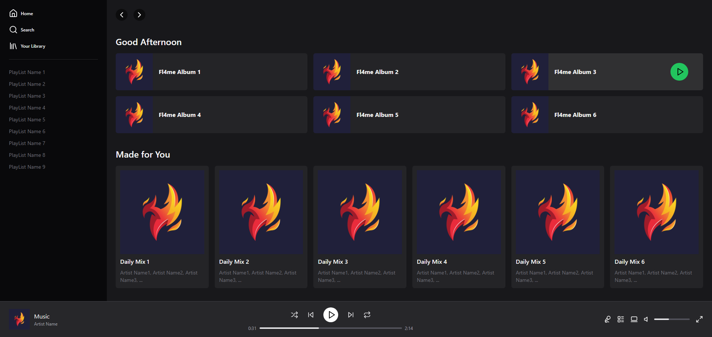

# Tailwind Spotify

<p align="center">
  
</p>

# About

This project consists of a simple link tree made in React with Vite, using styling through Tailwind CSS.

## Functionalities

- **Vite**: Uses Vite as the bundler for fast and efficient development.
- **React**: Basic implementation of React components to create a link tree interface.
- **Tailwind CSS**: Use of Tailwind CSS utility classes for responsive and modern styling.

## How to use

1. **Clone the repository**:

 ```bash
 git clone https://github.com/cesar-daniel15tailwind-spotify.git
 cd clone-linktree